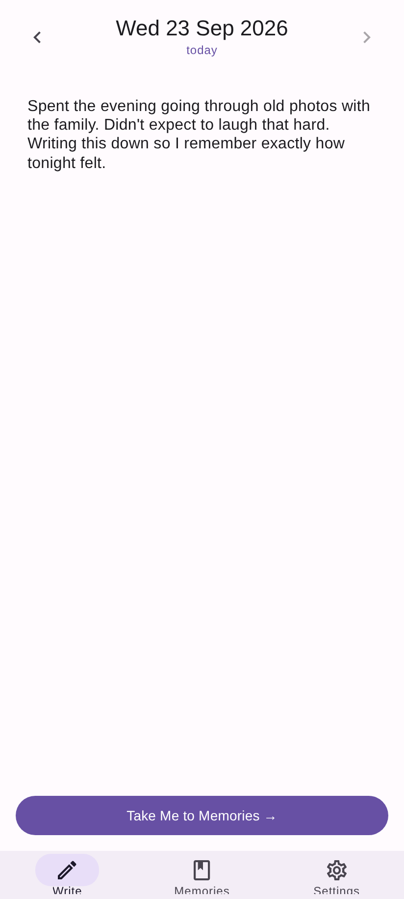
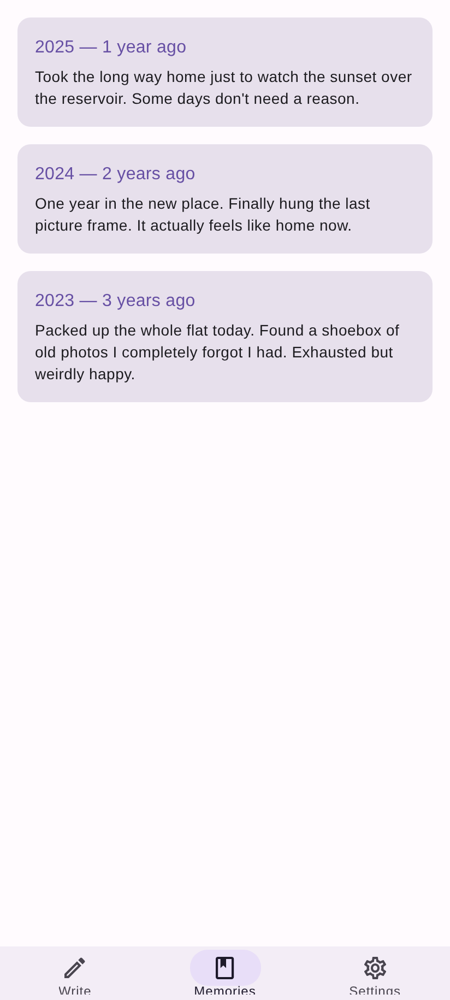
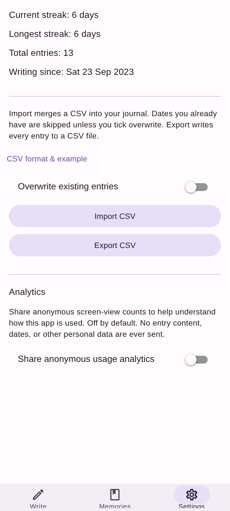

# ReminDiary

A daily journal for Android and the web that shows you your own past. Write today's
entry, save it, and the app surfaces what you wrote on this same date in previous years.

Everything lives on your device. No account, no sync. Your entries are yours, and CSV
export means they stay that way even if you stop using this. The only networking this
app does is an opt-in, off-by-default analytics toggle in Settings that shares anonymous
screen-view counts — never entry content, dates, or anything else you've written.

[](LICENSE)
[](https://github.com/grantstephens/ReminDiary/releases)

Built with [React Native](https://reactnative.dev) (Expo), targeting Android and the web.

<p>
  
  
  
</p>

## Installing

### With Obtainium (recommended)

[Obtainium](https://github.com/ImranR98/Obtainium) installs apps straight from GitHub and
keeps them updated, with no app store in the middle.

1. Install Obtainium.
2. Tap **Add App**.
3. Paste `https://github.com/grantstephens/ReminDiary`.
4. Tap **Add**, then **Install**.

Obtainium will notify you when a new release is tagged.

### Directly

Download the APK from the [Releases page](https://github.com/grantstephens/ReminDiary/releases)
and open it. Android will warn you about installing from an unknown source, because the
app is signed with the project's own key rather than distributed through Play.

> **On permissions:** every release declares **no Android permissions at all**. Check any
> release for yourself with `aapt dump permissions <apk>` — the list is empty.

## Using it

Three screens:

- **Write** — today's entry, one per calendar date. Saving reveals your Memories.
- **Memories** — what you wrote on this date in previous years, newest first, labelled
  "1 year ago", "2 years ago" and so on. Empty until you have a year of history.
- **Settings** — current streak, longest streak, total entries, the date you started
  (an unwritten *today* does not break your streak; an unwritten *yesterday* does), CSV
  export/import, and the light/dark appearance override.

There is deliberately no search, no calendar picker, no notifications and no future-dated
entries. It is a journal, not an organiser.

### Your data

On Android the database lives in the app's private storage, so **uninstalling the app
deletes your entries**. Export from the Settings screen before you uninstall, switch
devices, or do anything else drastic. On the web build, data lives in the browser's
IndexedDB and is subject to the same rule — clearing site data deletes it.

Import merges a CSV back in, skipping dates you already have unless you tick *Overwrite
existing entries*. Imports are all-or-nothing: the whole file is parsed and validated
before anything is written, so a malformed row cannot leave you half-imported.

### CSV format

```csv
date,body,created,updated
2026-08-19,"Multi-line bodies work fine, quotes and commas too",2026-08-19T18:42:00Z,2026-08-19T18:42:00Z
```

`created` and `updated` are optional on import. Dates are `YYYY-MM-DD`; timestamps are
RFC 3339 in UTC.

## Development

Toolchain is pinned in [`mise.toml`](mise.toml) — run `mise install` after cloning.
Install tools through `mise`, not a system package manager or a global `npm -g`.

```bash
make            # list every target
make check      # tsc --noEmit && jest — the gate before any commit
make start      # Expo dev server; scan the QR code with Expo Go
make web        # browser build, the no-device iteration story
make android    # Expo dev server, opening on a connected device
```

Android and the web are both shipping targets.

### Layout

```
src/domain/    pure TypeScript: dates, entries, the Store contract, stats
src/storage/   SqliteStore (Android) and IndexedDbStore (web), one shared contract
src/csv/       import and export
src/screens/   Write, Memories, Settings (stats and import/export combined)
src/platform/  the things that differ per target: files, dialogs, app-backgrounding
               signals, and the light/dark override (native-only)
src/theme.ts, src/ThemeContext.tsx   light/dark palettes and the provider that picks one
```

Dependencies point inward. `src/domain` imports nothing — no React, no Expo — which is
why it is tested in a plain Node environment.

### Releasing

Pushing a `v*` tag (e.g. `v1.0.0-beta.5`) triggers
[`.github/workflows/release.yml`](.github/workflows/release.yml), which builds a signed
APK and AAB and attaches them to a GitHub Release. `versionCode` is packed from the tag
itself (see [`tools/compute-version.sh`](tools/compute-version.sh) for the exact scheme),
so rebuilding a tag always reproduces the same value.

Before tagging, run `make prepare-release TAG=v1.0.1` — it computes the version and
commits it into `fdroid-version.txt`, so F-Droid's `checkupdates` (which can't do the
packing arithmetic itself) has a real, regex-extractable versionCode to read at that
tag. Then tag and push as the command's own output says:

```bash
make prepare-release TAG=v1.0.1
git tag v1.0.1
git push origin main v1.0.1
```

#### Signing setup

Android identifies an app by its signing certificate — every release must use the *same*
key, or existing users cannot upgrade and would have to uninstall, losing their journal.
Generate it once, back it up somewhere you trust, and never commit it:

```bash
keytool -genkeypair -v -keystore remindiary.keystore -storetype PKCS12 \
        -alias remindiary -keyalg RSA -keysize 4096 -validity 10000
```

Then set four repository secrets:

| Secret | Value |
|---|---|
| `ANDROID_KEYSTORE_BASE64` | base64 of the `.keystore` file |
| `ANDROID_KEYSTORE_PASSWORD` | keystore password |
| `ANDROID_KEY_ALIAS` | key alias (`remindiary` above) |
| `ANDROID_KEY_PASSWORD` | key password |

```bash
base64 -w0 remindiary.keystore | gh secret set ANDROID_KEYSTORE_BASE64
gh secret set ANDROID_KEYSTORE_PASSWORD
gh secret set ANDROID_KEY_ALIAS
gh secret set ANDROID_KEY_PASSWORD
```

## Licence

[GPL-3.0-or-later](LICENSE). If you distribute a modified version, you must publish your
changes under the same licence.
